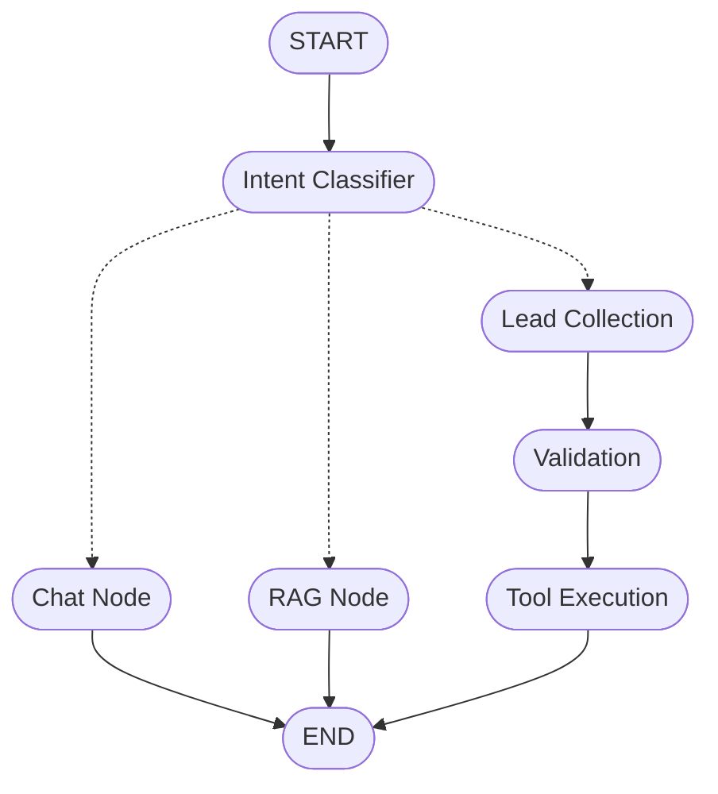

# leadx — Social-to-Lead AI agent


An agentic conversational AI system that converts user conversations into qualified business leads for a fictional SaaS product, AutoStream. 

Built as part of the ServiceHive – Inflx assignment, this project goes beyond a basic chatbot by integrating:

*  **Intent-aware routing**
*  **Retrieval-Augmented Generation (RAG)**
*  **Multi-turn stateful conversations**
*  **Lead qualification workflow**
*  **Tool execution (mock lead capture)**

---

##  System Architecture



---

##  Core Features

###  Intent Classification
Classifies user input into:
* Greeting
* Product Inquiry
* High-Intent Lead

###  RAG-Based Knowledge Retrieval
* Answers pricing & feature queries from a local knowledge base.
* Ensures grounded and accurate responses.

###  Stateful Conversations
Maintains multi-turn memory using LangGraph state + checkpointing. Tracks:
* Name
* Email
* Platform
* Lead Stage

###  Lead Qualification Flow
An intelligent data-gathering node that dynamically collects essential lead information. It elegantly handles incomplete data, validates formatting, and prompts the user for missing details without breaking character.

###  Tool Execution
Calls a mock API only after validation:
```python
def mock_lead_capture(name, email, platform):
    print(f"Lead captured successfully: {name}, {email}, {platform}")
```

###  Observability with LangSmith (Optional added feature)

This project integrates **LangSmith** for tracing and debugging LLM interactions.

### What it provides
- End-to-end execution tracing
- Node-level visibility in LangGraph
- Debugging of prompts and responses
- Performance monitoring

---

##  How to Run Locally
> ⚠️ **Note:** This project requires API keys (Gemini & HuggingFace).  
> Please follow the setup instructions in the "How to Run Locally" section.

**1. Clone the repository**
```bash
git clone https://github.com/sehajsukhleensingh/leadx-ai-agent.git
cd leadx-ai-agent
```

**2. Create a virtual environment**
```bash
python3 -m venv autoSvenv
source autoSvenv/bin/activate
```

**3. Install dependencies**
```bash
pip install -r requirements.txt
```

**4. Setup Environment Variables (.env)**
This project uses the **Google Gemini API** for LLM responses and the **HuggingFace API** for embeddings (RAG).

Create a `.env` file in your project root:
```bash
touch .env
```

**5. Get API Keys (FREE) & Add to `.env`**
*  **Gemini API (Google AI Studio):** Go to https://aistudio.google.com/app/apikey, click "Create API Key", and paste it into your `.env`.
*  **HuggingFace API (Embeddings):** Go to https://huggingface.co/settings/tokens, create a Read Token, and paste it into your `.env`.

Add the following keys to your `.env` file:
```env
GOOGLE_API_KEY=your_gemini_api_key_here
HUGGINGFACEHUB_API_TOKEN=your_huggingface_api_key_here
```

**6. Run the application**
```bash
python3 -m main
```

**7. ⚠️ Optional Setup**

LangSmith is **not required** to run this project.
The system works fully without it.
To enable tracing, add the following to your `.env`:

```env
LANGSMITH_TRACING=true
LANGSMITH_ENDPOINT=https://api.smith.langchain.com
LANGSMITH_API_KEY=your_langsmith_api_key
LANGSMITH_PROJECT=leadx-agent
```

**8. Interact via terminal**
*Example output:*
> **You:** Hi 
>
> **Bot:** Hello! How can I assist you today?
> 
> **You:** Tell me about pricing
>
> **Bot:** *(RAG response)*

---

##  Architecture Explanation

This project leverages **LangGraph** to design a structured, stateful conversational agent. Unlike traditional loops, LangGraph models the conversation flow as a directed graph, enabling strict modularity and a clear separation of concerns between different nodes.

Thread-Level Persistence with SQLite
To handle real-world user interruptions and multi-turn data gathering, leadx implements robust checkpointing using SQLite.

Instead of relying on ephemeral in-memory variables, the conversation state is saved to a local SQLite database after every interaction. By passing a unique thread_id (such as a session ID or phone number) during the graph invocation, the agent instantly recalls previous context:

```
from langgraph.checkpoint.sqlite import SqliteSaver
import sqlite3

# Initialize SQLite Checkpointer
conn = sqlite3.connect("checkpoints.sqlite", check_same_thread=False)
memory = SqliteSaver(conn)

# Invoke graph with a specific user thread
config = {"configurable": {"thread_id": "user_whatsapp_12345"}}
bot.invoke({"messages": [HumanMessage(content=user_input)]}, config=config)
```
**Why this matters:** A user can start the lead flow, leave the chat for three hours, and when they return, the agent resumes exactly where they left off without asking for their name a second time.

Each node performs a specific responsibility:
* **The Intent Classifier** routes user queries.
* **The RAG Node** handles knowledge-based responses.
* **The Lead Collection Node** manages multi-turn data gathering.
* **The Validation Node** ensures the correctness of user inputs.
* **The Tool Node** executes business actions.

State is managed using LangGraph’s built-in state system with checkpointing, allowing the persistence of conversation context across multiple user turns. Instead of looping inside the graph, each user message triggers a fresh execution while loading the previous state, creating a seamless conversational experience. This architecture ensures modularity, scalability, and production-readiness, making it easy to extend with additional tools or integrations.

---

##  WhatsApp Integration (Using Webhooks)

To integrate this agent with WhatsApp:
1. Use the WhatsApp Business API (via Meta or Twilio).
2. Configure a webhook endpoint (FastAPI server).

**Flow:**
`User → WhatsApp → Webhook → Agent → Response → WhatsApp`

**Steps:**
Receive the incoming message via webhook. Extract the User Message and User ID (used as `thread_id`), and pass it to the agent:
```python
bot.invoke(
    {"messages": [HumanMessage(content=user_input)]},
    config={"configurable": {"thread_id": user_id}}
)
```
Send the response back via the WhatsApp API.

**Key Advantage:** Each WhatsApp user gets a persistent conversation memory, enabling real-time lead capture at scale.

---

##  Demo

The demo video showcases:
* Pricing query (RAG)
* Intent detection
* Lead collection
* Validation
* Tool execution

---

##  Tech Stack

* Python 3.11+
* LangChain & LangGraph
* Gemini (LLM)
* FastAPI *(optional extension)*
* Pydantic
* SQLite / In-Memory Checkpointing

---

##  Conclusion

This project demonstrates how to build a real-world agentic AI system that understands intent, retrieves knowledge, manages state, and executes actions. It moves beyond simple chatbots into intelligent, production-ready AI workflows.

---

**Author :** 
Sehaj Sukhleen Singh